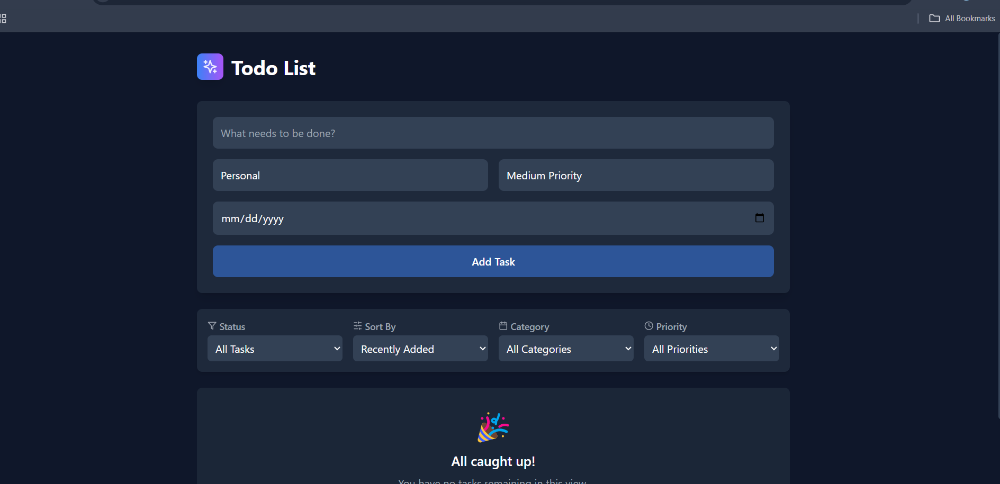
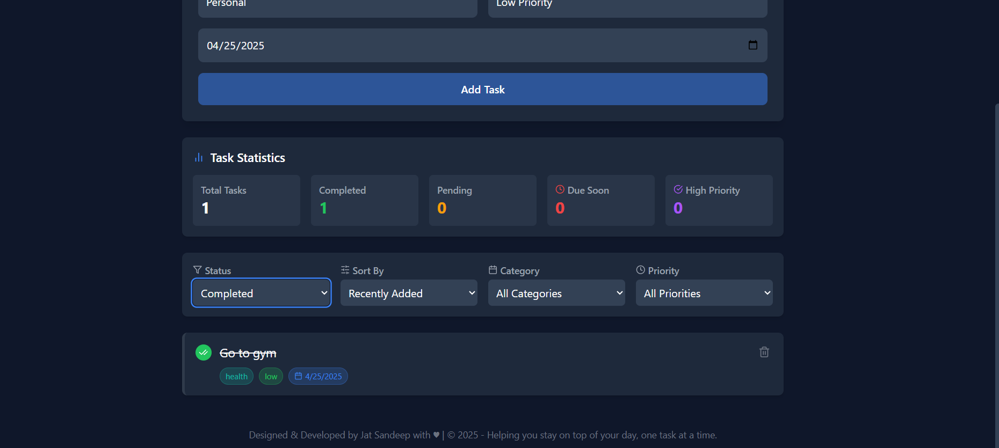
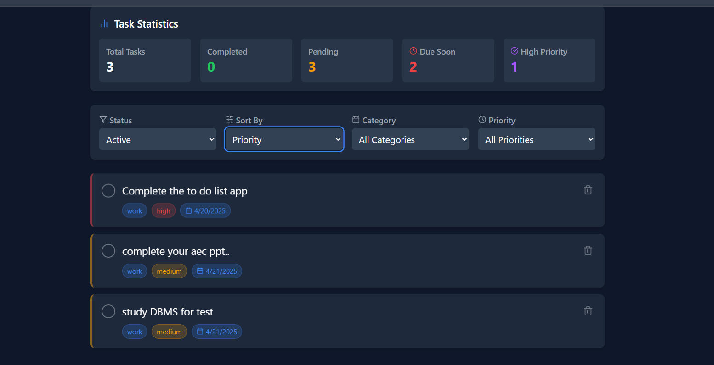
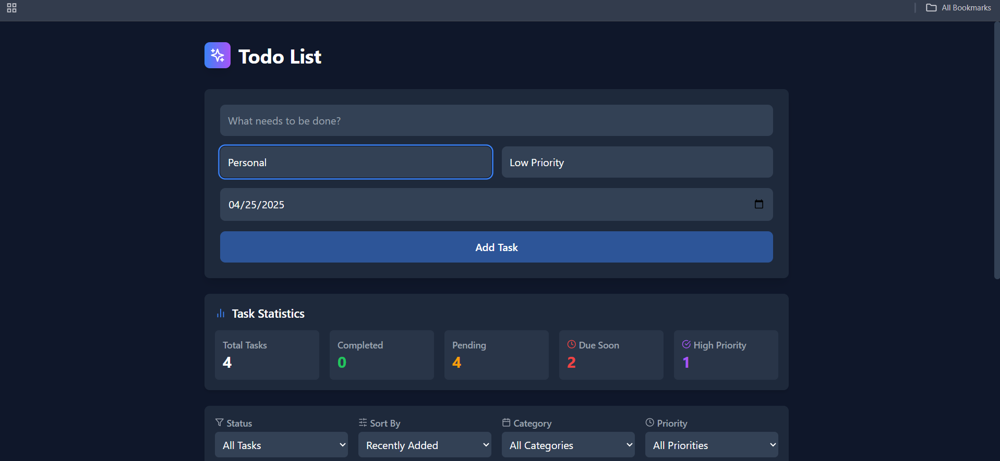

# 📝 To-Do List App — React.js + Tailwind CSS

A modern, responsive To-Do List application built using React.js and styled with Tailwind CSS. This application allows users to manage daily tasks efficiently — including adding, deleting, and tracking task progress with a clean UI.

---

## 📸 Screenshots

**Main Interface**  


**Task Statistics**  


**Task View**  


**Alternative Task View**  


---

## 🚀 Features

- Add and delete tasks with ease
- Track task completion statistics
- Clean and minimal user interface
- Responsive design for all screen sizes
- Built with Vite for optimal performance

---

## 🛠️ Tech Stack

- **Frontend:** React.js
- **Styling:** Tailwind CSS
- **Bundler:** Vite
- **Language:** JavaScript (ES6+)

---

## 📁 Project Structure

```bash
.
├── SCREENSHOT/
├── src/
│   ├── components/        # Reusable UI components
│   ├── hooks/             # Custom React hooks
│   ├── types/             # Type definitions (TypeScript)
│   ├── utils/             # Utility functions
│   ├── App.jsx
│   ├── index.css
│   └── main.jsx
├── public/
├── tailwind.config.js
├── vite.config.js
├── package.json
└── README.md
```

---

## ⚙️ Getting Started

### Prerequisites

- Node.js and npm installed

### Installation

1. **Clone the repository**

   ```bash
   git clone https://github.com/JAT-SANDEEP8117/To_dolist_react_js.git
   cd To_dolist_react_js
   ```

2. **Install dependencies**

   ```bash
   npm install
   ```

3. **Start the development server**

   ```bash
   npm run dev
   ```

4. Open your browser at `http://localhost:5173`

---

## 🤝 Contribution

Contributions are welcome!  
If you'd like to improve this project, feel free to fork it and submit a pull request.

```bash
# Fork the repo
# Create a feature branch
git checkout -b feature/YourFeature

# Make your changes
# Commit and push
git commit -m "Add YourFeature"
git push origin feature/YourFeature

# Submit a pull request
```

---

## 📄 License

This project is open source and available under the [MIT License](LICENSE).

---

## 👤 Author

**Sandeep Jat**  
GitHub: [@JAT-SANDEEP8117](https://github.com/JAT-SANDEEP8117)

---

> *Future enhancements may include theme toggling and additional filtering options.*
